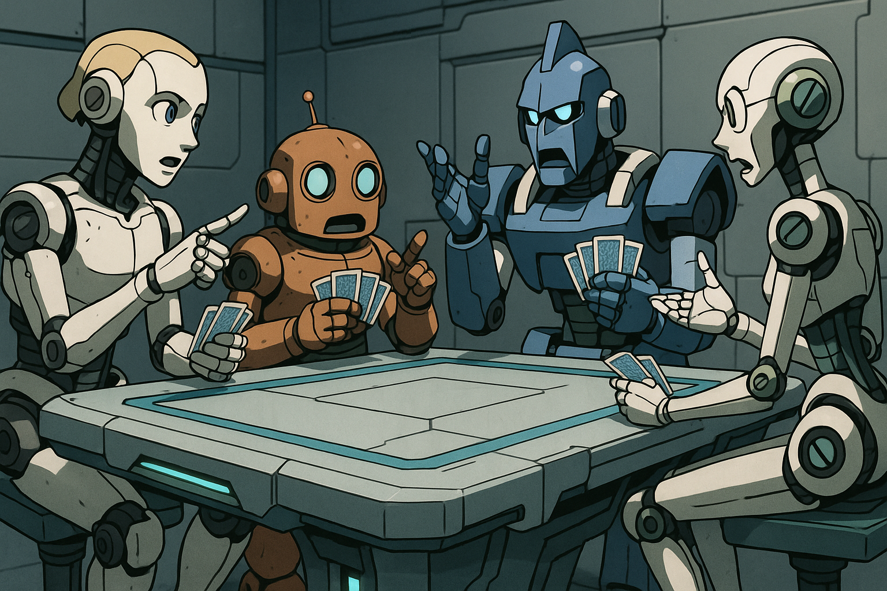

# Social Deduction Game Arena

A flexible framework for running social deduction games played by language models.

## Features
- **Flexible Rule System**: Play both classic social deduction games (e.g., Werewolf, Word Wolf, or Resistance Avalon) and custom rule sets by simply providing text-based rule files
- **Fully Conversation-based**: Game progression is managed by a language model Game Master, where all game actions including discussions, votes, and investigation results are handled through natural conversations between players and the GM



## Overview

This project provides:
- **Game Arena** (`sdg_arena.py`): Core engine for running social deduction games with AI agents
- **Rule Generator** (`scripts/generate_rule.py`): LLM-powered tool for generating game rules from plain text descriptions
- **Pre-built Games**: Collection of classic social deduction games (Werewolf, Resistance, Spyfall, etc.)

## Model Requirements

**Important**: This system requires LLMs with high reasoning capabilities for both players and Game Master roles. Recommended models include:

- **OpenAI**: `openai:o3`
- **OpenRouter**: `openrouter:deepseek/deepseek-r1-0528`

Models like GPT-3.5 or Claude Haiku may not perform well due to the complex reasoning required for social deduction gameplay.

## Installation

1. **Clone the repository**:
   ```bash
   git clone <repository-url>
   cd social_deduction_game_arena
   ```

2. **Install dependencies**:
   ```bash
   pip install -r requirements.txt
   ```

3. **Configure API keys**: Set up your LLM API keys as environment variables:
   ```bash
   export OPENAI_API_KEY="your-openai-key"
   export ANTHROPIC_API_KEY="your-anthropic-key"
   export OPENROUTER_API_KEY="your-openrouter-key"
   ```

## Usage

### Running Games with sdg_arena.py

The main game engine supports running complete social deduction games with AI agents.

#### Basic Usage

```bash
python sdg_arena.py --rules rules/werewolf.txt --players 5 --player-model openai:o3
```

#### Advanced Usage

```bash
python sdg_arena.py \
  --rules rules/resistance_avalon.txt \
  --players 6 \
  --player-model openrouter:deepseek/deepseek-r1-0528 \
  --gm-model openai:o3 \
  --out-dir game_logs/avalon_game_001 \
  --max-turns 50
```

#### Command Line Options

- `--rules` (required): Path to the game rules file
- `--players`: Number of players (default: 5)
- `--player-model`: Model specification for players (default: "openai:o3")
- `--gm-model`: Model specification for Game Master (uses player-model if not specified)
- `--out-dir`: Output directory for game logs (default: "game_logs")
- `--max-turns`: Maximum number of game turns (default: 100)

#### Model Specification Format

Models are specified as `provider:model_name`, for example:
- `openai:o3`
- `openai:o3-mini`
- `openrouter:deepseek/deepseek-r1-0528`
- `anthropic:claude-3.5-sonnet`

#### Available Games

The system includes several pre-built social deduction games:

- **Werewolf** (`rules/werewolf.txt`): Classic Mafia-style game with Werewolves vs Villagers
- **Resistance: Avalon** (`rules/resistance_avalon.txt`): Mission-based game with Merlin and Mordred
- **Spyfall** (`rules/spyfall.txt`): Location-guessing game with hidden spy
- **Insider** (`rules/insider.txt`): Word-guessing game with hidden insider role
- **Word Wolf** (`rules/word_wolf.txt`): Similar word variant with minority detection

### Generating Rules with generate_rule.py

Create custom game rules from plain text descriptions using LLM.

#### Basic Usage

```bash
python scripts/generate_rule.py \
  --description "A social deduction game where spies infiltrate government agents..." \
  --output rules/my_game.txt
```

#### Pipeline Usage

```bash
cat scripts/sample_rule_seed.txt | python scripts/generate_rule.py --output rules/my_game.txt
```

```bash
echo "Your game description here" | python scripts/generate_rule.py --output rules/my_game.txt
```

#### Running Generated Custom Game

```bash
python sdg_arena.py \
  --rules rules/my_game.txt \
  --players 6 \
  --player-model openrouter:deepseek/deepseek-r1-0528
```

## Related Projects
- [Werewolf Arena](https://github.com/google/werewolf_arena)

---
## Example Game Output

Here's what a typical Werewolf game looks like when run with the system:

```
$ python sdg_arena.py --rules rules/werewolf.txt --players 5
Starting game with 5 players

=== Turn 1 ===
[01] GM▶P1: You are a Villager. You have no special abilities. Work with the other villagers to identify and eliminate the werewolf. You win when the werewolf is dead.
[01] GM▶P2: You are a Villager. You have no special abilities. Work with the other villagers to identify and eliminate the werewolf. You win when the werewolf is dead.
[01] GM▶P3: You are THE Werewolf. Each night you must choose one player to eliminate (DM me their name during the night phase). There are no other werewolves. You win when the number of living werewolves is at least equal to the number of living villagers.
[01] GM▶P4: You are a Villager. You have no special abilities. Work with the other villagers to identify and eliminate the werewolf. You win when the werewolf is dead.
[01] GM▶P5: You are a Villager. You have no special abilities. Work with the other villagers to identify and eliminate the werewolf. You win when the werewolf is dead.
[01] GM▶ALL: Game start! There is 1 Werewolf among you.
Day 1 Discussion Phase begins now. Feel free to discuss openly. When you are ready to vote, let me know and I will open the Voting Phase.

=== Turn 2 ===
[02] P2▶ALL: Hi everyone, P2 here. We're 4 villagers versus 1 wolf, so talking is all we've got. Let's each share initial thoughts or gut reads—silence only helps the werewolf. I'd like to hear from P3 and P4 first since they haven't spoken yet. What do you all think about doing a quick round-robin of suspicions before we move to voting?

=== Turn 3 ===
[03] P4▶ALL: Hey everyone, P4 here. I agree with P2—conversation is our only tool. Right now the only data point is that P2 kicked things off, which feels mildly town to me because wolves often prefer low engagement. I'd like to hear from P3, P1, and P5 so we can get some real signals before voting. No strong suspicions yet; let's all speak up.

=== Turn 4 ===
[04] P1▶ALL: Hey all, P1 checking in. I'm on board with an open info-gathering round. Right now P2 and P4 talking first feels slightly villager-leaning to me (wolves often lurk), but that's super thin. We really need P3 and P5 to weigh in so we can look for any inconsistencies or slip-ups. @P3, @P5—what's your take on early voting? I'm okay moving to Vote Phase once everyone has spoken at least once.

=== Turn 5 ===
[05] P3▶ALL: Hey everyone, sorry for the late entrance—just catching up. I'm on board with the round-robin idea. So far the only thing that pings me is that P5 hasn't chimed in; silence is always a little suspect. P2 and P4 starting discussion looks village-leaning, and P1's follow-up feels fine. I'd rather hear from P5 before we push to a vote. Thoughts on holding off until we've all spoken?

=== Turn 6 ===
[06] P5▶ALL: Hey everyone, sorry for the late check-in—real-life distraction. I'm a villager and want to avoid a random lynch. Quick impressions: P2 & P4 kicked things off with constructive prompts—slight town lean. P1's follow-up feels consistent. P3 noted my silence while arriving late themselves; not wolfy by itself but worth watching. No solid scum read yet. I'm fine opening Vote Phase once we each state where we'd lean right now so we have something concrete to analyze tomorrow. My tentative lean would be P3 if forced, but that's soft. Happy to hear counter-arguments before we lock votes.

=== Turn 7 ===
[07] P2▶ALL: Thanks everyone. My quick reads: P3 calling out P5 for silence while arriving last themselves feels a bit opportunistic—so mild wolf lean there. P5's response struck me as genuine, and P4 & P1 still read townie for early engagement. I'm currently leaning P3 but I'm open to counter-arguments. If no one objects, I'd like to move to the Vote Phase soon so we have concrete votes to dissect tomorrow. Before that, could each of you state (1) your primary suspect and (2) a fallback choice in case of ties? That info will help guide a smarter vote.

=== Turn 8 ===
[08] P3▶ALL: Appreciate the clarity request, P2. My primary suspect right now is P5. The sequence—silent → apologetic catch-up → immediately shading me for pointing out that silence—looks like deflective play. My fallback would be P2, because the quick tunnel on me (and the push for preset fallback votes) could be a wolf trying to lock in a mis-lynch. I'm still weighing things, but that's where I stand for now. P1 and P4, how do you see P5's pivot and P2's push?
[08] GM▶ALL: Voting Phase begins now. Discussion is closed. Each living player, please DM me exactly ONE name you wish to eliminate. You have until I announce results to submit your vote.

=== Turn 9 ===
[09] P1▶GM: P3
[09] P2▶GM: P3
[09] P3▶GM: P5
[09] P4▶GM: P3
[09] P5▶GM: P3
[09] GM▶ALL: Voting results: P1→P3, P2→P3, P3→P5, P4→P3, P5→P3.

With 4 votes, P3 is eliminated.

P3 was the Werewolf.

All werewolves are dead. Villagers win!

Game concluded. Thanks for playing!
Game ended with winner: Villagers
GAME END: Winner = Villagers (Turn 9)
Game completed: {'success': True, 'game_completed': True, 'winner': 'Villagers', 'turn_count': 9, 'max_turns': 100, 'max_turns_reached': False, 'total_messages': 20, 'players': ['P1', 'P2', 'P3', 'P4', 'P5'], 'rules_file': 'rules/werewolf.txt'}
```
